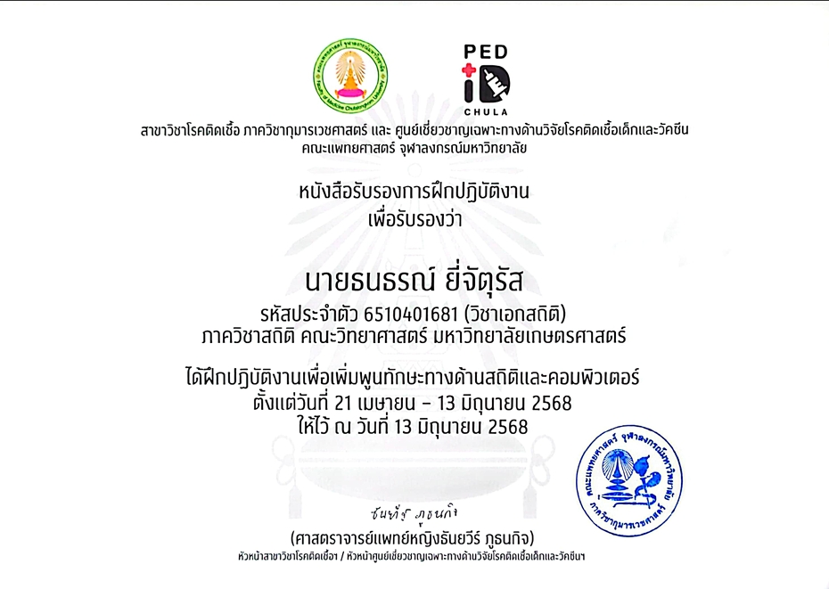

# Education
---
Kasetsart University (2022 - 2025) 
Bachelor of Science in Statistics 
Cumulative GPA: 3.52/4.00  

---
# Skills
---
- **Data Science:** Statistical Modeling and Analysis, Data Visualization, Data Wrangling
- **Programming:** Python, R, Stata, Minitab, SPSS, Microsoft Excel
- **Soft Skills:** Adaptability, Analytical Thinking, Collaboration, Communication, Problem-Solving

---
# Work Experience
---
## Research Trainee at Division of Infectious Diseases, Department of Pediatrics, and Center of Excellence in Pediatric Infectious Diseases and Vaccines, Faculty of Medicine, Chulalongkorn University (_April - June 2025_)
- **RSV Prophylaxis Project**—Analyzed medical costs, length of stay, and oxygen therapy requirements across risk groups
using descriptive statistics, comparing outpatient (OPD) and inpatient (IPD) records.
- **Remdesivir Use in Pediatric COVID-19 Project**—Conducted statistical analysis in Stata, including chi-square tests and
univariate and stepwise multivariate logistic regression, to assess predictors of disease severity among patients aged up
to 18 years.

---
## Survey and Data Analyst at Buddy CU Clinic, Center of Excellence for Pediatric Infectious Diseases and Vaccines, Faculty of Medicine, Chulalongkorn University (_January 2025 - April 2026_)

- **A Survey of Adolescent and Youth Perspectives on Condom Use**—A survey was conducted via Google Forms, targeting
youth aged 15–24 years in Bangkok. The data was analyzed using Stata to identify factors contributing to the non-use
of condoms during sexual intercourse, employing both descriptive statistics and Chi-square tests.

---
# Academic Projects
---

## Predicting E-Cigarette Use Among Thai Youth Using Machine Learning: The Role of Mental Health and Risk Behaviors

- Evaluate the performance across five machine learning models. 
- Compare performance of five machine learning models and Three Imbalance methods for detecting E-cigarttes User. 
- Identified key factors associated with e-cigarette use among Thai youth. 
- Prepared the results in the form of a full report, an English research article, and a poster for the NovaSciKU 2026. 

---
## Factor Association of Mortality Risk Among People Living with HIV Antiretroviral Therapy Initiation in Thailand: A Stratified Cox Proportional Hazards Model

- Applied and compared Poisson and Negative Binomial regression models to address overdispersion and improve model accuracy. 
- Analyzed temporal and regional patterns using time series techniques to uncover seasonal trends and risk disparities. 
- Translated complex analytical findings into actionable insights to support data-driven public health decision-making. 
- Conducted advanced statistical analysis on large-scale public health data to identify key mortality risk factors.. 

